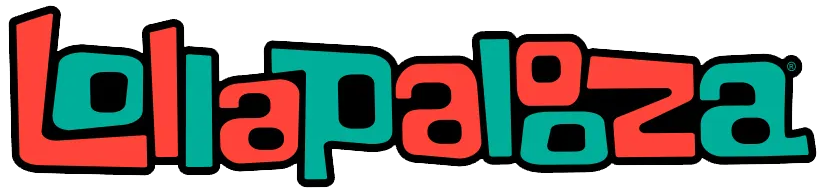

## 🤘 LET'S ROCK! 

>There are only a few weeks left until   takes place, so let's *warm up* by replicating a very rocking flyer.

### Before starting:

**The goal** is for you to replicate the flyer styles that you will find in the `original-flyer.jpg` file.

In this repository you will find **almost everything** you need to solve the task.

In the `/styles` folder you will find the `normalize.css` file that is already linked in the `index.html`. 

> 💡  This file  makes browsers render all elements more consistently and in line with modern standards.  
In other words, it overwrites or modifies some style properties that the user-agent (browser) injects in every html and we usually don't want. For example: an 8px margin in the body element or some default margins in the headings or paragraph elements. 

In this same folder is the `styles.css` file. This is the file where you will add all the styles you want. 

In the `/assets` folder you have the flyer background. You can also use this folder to save any other image or icon files.

---

### Minimum requirements:

- The fonts must be as similar as possible to the original file. 

    - Remember that you can download free fonts from [1001freefonts](https://www.1001freefonts.com/) and add the necessary files to the project.

    - You can also work with [Google fonts]( https://fonts.google.com/) and link the fonts to the project by inserting the script that the site gives you, as we saw in the last session.

- The spaces and distances between words should be as precise as possible. Please avoid using the ` ` tag as much as possible.

    - To achieve this you can work with the **margin and padding** properties.
    - Start with these [Box model docs](https://www.w3schools.com/css/css_boxmodel.asp)
    - Then read the following [Margin docs](https://www.w3schools.com/css/css_margin.asp)
    - And finally take a look at these [Padding docs](https://www.w3schools.com/css/css_padding.asp)

- All the text elements must be added only inside the `
` with the class "flyer"
 

>🔍 Hint: [text-align](https://www.w3schools.com/cssref/pr_text_text-align.php) is a property that you may also find usefull to align some words.

---
### Steps:

1. **Fork** this repository. This action makes a copy in your GitHub account. 
2. **Clone** the forked repository from your own GitHub account. 
3. Open the folder in VSC
4. Link the `styles.css` file to the `index.html` file.
5. Complete the path to the `flyer.png` file inside the `url()` value of the `background-image` property.   
6. Add all the HTML text elements you in order.
7. You can replace the original band names with the bands you want 😉.
7. You can organize the text content in `<section>`, `<article>` or `
`elements as you need.
8. Don´t forget to read the **documentation** you will find at the bottom of these instructions 🤓.

### 🏆 Gives extra points:

- Include all the icons you see in the flyer. You can use `svg` or `png` files. 
- How about you investigate how to place the letters inside the first banner following its curved shape?

### 🚀 Happy coding 🚀

### Essential documentation:
- [Selectors](https://www.w3schools.com/css/css_selectors.asp)
- [Text color](https://www.w3schools.com/css/css_text.asp)
- [Font-family](https://www.w3schools.com/css/css_font.asp)
- [Font-size](https://www.w3schools.com/cssref/pr_font_font-size.asp)
- [Font-weight](https://www.w3schools.com/cssref/pr_font_weight.asp)
- [Text-align](https://www.w3schools.com/cssref/pr_text_text-align.asp)
- [Word-wrap](https://www.w3schools.com/cssref/css3_pr_word-wrap.asp)
- [Margin](https://www.w3schools.com/css/css_margin.asp)
- [Padding](https://www.w3schools.com/css/css_padding.asp)

### Extra text styles docs: 
- [Line-height](https://www.w3schools.com/cssref/pr_dim_line-height.asp)
- [Text-decoration](https://www.w3schools.com/cssref/pr_text_text-decoration.asp)
- [Word-spacing](https://www.w3schools.com/cssref/pr_text_word-spacing.asp)
- [Writing-mode](https://www.w3schools.com/cssref/css3_pr_writing-mode.asp)
- [Quotes](https://www.w3schools.com/cssref/pr_gen_quotes.asp)
- [Hyphens](https://www.w3schools.com/cssref/css3_pr_hyphens.asp)

Made with 💜 by SolZeta
